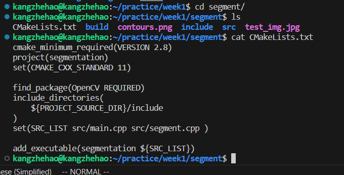

####第一周任务
* **任务一要求:在自己的机器上配置双系统或者使用WSL2，拥有自己的linux系统**
 如图成功配置wsl2的环境，并可以正常使用
* **任务二要求：参考上述内容，使用命令行在主目录也就是 下，使用mkdir新建一个任务文件夹，使用cd进入该文件夹，使用touch新建cpp代码文件，编写helloword代码，使用gcc编译，执行可执行文件，能够正确输出。（能够自己查阅不熟悉的命令）**

*使用gcc命令编译c++程序时需要加上-lstdc++指定使用c++标准库*

*直接使用g++命令编译*
* **任务三要求：参考上述资料，使用CMake编译任务三中的helloworld代码，然后cd进入build目录，使用cmake..命令，然后使用make命令生成执行文件**
    1. CMakeLists文件的编写：
    
    2. 用CMake编译cpp文件：
    
* **任务要求：查阅CMake资料，能够在build文件夹下成功编译并运行可执行文件，不报错**
    1. CMakeLists文件的编写：
    
    2. 直接运行遇到报错：
    
    *查找资料发现是Opencv库的问题，新版本中createTrackbar通过指针传递返回值被认为是不安全的，已被弃用*
    3. 查阅相关资料得出的解决方法为使用值传递：
    *传递空指针防止报错*
    
    *在回调函数中取滑动条的值*
    
    *无报错，正常运行*
    
